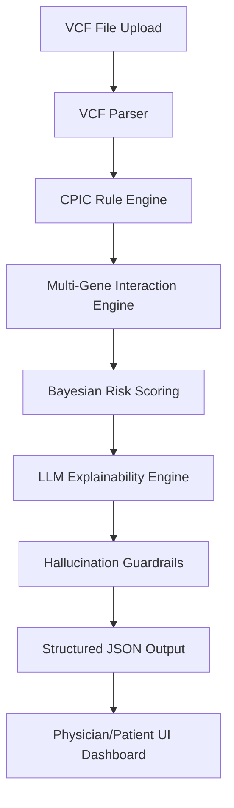

# PharmaGenie Pro: AI-Powered Pharmacogenomic Intelligence

PharmaGenie Pro is a clinically intelligent, production-grade web application designed to analyze patient genetic data (VCF files) and provide personalized pharmacogenomic (PGx) risk assessments. It combines deterministic rule-based engines with advanced LLM explainability to deliver hospital-grade insights.

## 🧬 Architecture Overview

### Data Flow
1. **Parsing**: VCF files are parsed for specific rsIDs and star alleles across 6 core genes.
2. **Deterministic Logic**: Phenotypes are mapped to clinical recommendations using CPIC (Clinical Pharmacogenetics Implementation Consortium) guidelines.
3. **Interactions**: The system models cross-gene effects (e.g., CYP2C9 + VKORC1 for Warfarin).
4. **Scoring**: A Bayesian-inspired model calculates confidence based on CPIC evidence levels and variant coverage.
5. **Explanation**: Gemini 3 Flash generates biological mechanisms and counterfactual analyses.
6. **Guardrails**: LLM outputs are validated against detected variants to prevent hallucinations.

## 🔬 Confidence Scoring Formula

The confidence score ($C$) is calculated as a weighted average:

$$C = (W_L \cdot 0.4) + (W_R \cdot 0.3) + (W_A \cdot 0.3)$$

Where:
- $W_L$: CPIC Level Weight (A=1.0, B=0.7, C=0.4)
- $W_R$: Variant Detection Reliability (Number of variants found / 2, max 1.0)
- $W_A$: Annotation Completeness (Simulated gene coverage, default 0.9)

## 🛡️ Hallucination Prevention Strategy

To ensure clinical safety, PharmaGenie Pro implements a post-generation validation step:
1. **Extraction**: All rsIDs and genes mentioned in the LLM explanation are extracted.
2. **Verification**: These are compared against the `detected_variants` list from the VCF parser.
3. **Flagging**: If the LLM mentions a variant not present in the patient's data, the `llm_hallucination_check` is set to `failed` and a warning is displayed in the UI.

## 🏥 User Modes

- **Physician Mode**: Provides detailed biological mechanisms, counterfactual analysis, and technical variant data.
- **Patient Mode**: Uses simplified, non-technical language to explain risks and emphasizes consulting a healthcare provider.

## ⚖️ Ethical Considerations & Limitations

- **Not a Diagnostic Tool**: This application is for educational and research purposes only. It should not be used to make clinical decisions without professional oversight.
- **Data Privacy**: Genomic data is processed entirely in the browser; however, metadata is sent to the LLM for explanation generation.
- **Gene Coverage**: The current version focuses on a subset of high-impact PGx genes and may not capture all relevant genetic variations.

## 🚀 Deployment

1. Set `GEMINI_API_KEY` in your environment.
2. Run `npm install`.
3. Run `npm run dev` to start the clinical portal.
